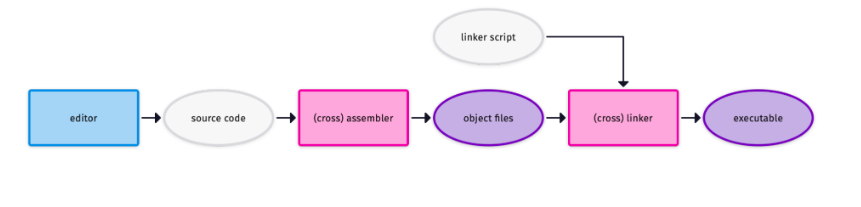

# Foundation of RISC-V Assembly Programming

[[RISC-V Assembly manual](https://github.com/riscv-non-isa/riscv-asm-manual/blob/master/riscv-asm.md)], [[RISC-V ELF spec](https://github.com/riscv-non-isa/riscv-elf-psabi-doc/blob/master/riscv-elf.adoc)], [[RISC-V Calling Conventions](https://github.com/riscv-non-isa/riscv-elf-psabi-doc/blob/master/riscv-cc.adoc)], [[GNU Assembler Directives](https://sourceware.org/binutils/docs/as/Pseudo-Ops.html)]

Flow from assembly program to the corresponding binary executable is depicted in the figure below.

## Prerequisites

Let's setup tools to compile and debug the RISC-V Assembly programs.

:warning: These instructions are applicable for Linux Debian distribution.
- Qemu Emulator: Qemu Emulator to run and simulate RISC-V programs.

        sudo apt-get install qemu-system-misc qemu-user-static binfmt-support opensbi u-boot-qemu 
- Cross Compiler Toolchain: GNU Compiler Toolchain to compile the assembly programs.

        sudo apt-get install gcc-riscv64-linux-gnu

- Debugger: In order to debug the assembly programs install GDB-multiarch.

        sudo apt-get install gdb-multiarch

## Getting Started

Let's take an example assembly [program](example/src/example.s) as follows

    .text
    .global _start

    _start:
        addi x10, x0, 7
        addi x17, x0, 93
        add  t0, x10,x17
        ecall

### Compiling the assembly program

1. Creating Object File from assembly by running:
    
        riscv64-linux-gnu-as -o example.o example.S

2. To obtain executable from the object file using the toolchain (linux) linker file, run the following command

        riscv64-linux-gnu-ld -o example example.o

3. The disassembly of the executable can be obtained by running.

        riscv64-linux-gnu-objdump -sd example

    :bulb: `riscv64-linux-gnu-objdump --H` for more dump options 

4. Emulating and Debugging

        qemu-riscv64-static -g 1234 example

    After running the above command, leave the terminal window as it is, open another terminal window and run

        gdb-multiarch example

    The debugger will open. Now, run the following command to connect the debugger with the qemu port `1234`

        (gdb) target remote :1234

    Now, it's connected. In order to look at the code on terminal for debugging, obtain chucnk of source code on the terminal window by specifying the number of lines.

        (gdb) display /3i $pc

    Here, `3` is the number of lines of source code and `i` represents the instructions.

Other gdb options:
- `si` to step each instruction for debugging.
- `c` to continue to iterate through the whole program.
- `q` to quit the debugger.

### GNU Binary Utilities for RISC-V Asm
[[GNU Bin Utilities](https://sourceware.org/binutils/docs-2.29/binutils/index.html)]

Below are some of the widely GNU binary utilities by RISC-V toolchain. For all the available utilities, visit the documentation.

prefix: `riscv64-linux-gnu` or `riscv64-elf` 
- (prefix)-objdump [--help, --info]
- (prefix)-objcopy [--help, --info]
- (prefix)-readelf
- elf2hex

## Full system Emulation

To emulate a full system, a further step is necessary. A whole system needs a boot and system image to start up. You can download pre-baked images from [DQIB](https://people.debian.org/~gio/dqib/). Download the file for riscv64-virt and extract the file. There is helpful information in a readme.txt. However, you should be able to emulate the system by typing this command:

    qemu-system-riscv64 -machine virt -cpu rv64 -m 1G -device virtio-blk-device,drive=hd -drive file=image.qcow2,if=none,id=hd -device virtio-net-device,netdev=net -netdev user,id=net,hostfwd=tcp::2222-:22 -bios /usr/lib/riscv64-linux-gnu/opensbi/generic/fw_jump.elf -kernel /usr/lib/u-boot/qemu-riscv64_smode/uboot.elf -object rng-random,filename=/dev/urandom,id=rng -device virtio-rng-device,rng=rng -nographic -append "root=LABEL=rootfs console=ttyS0"

